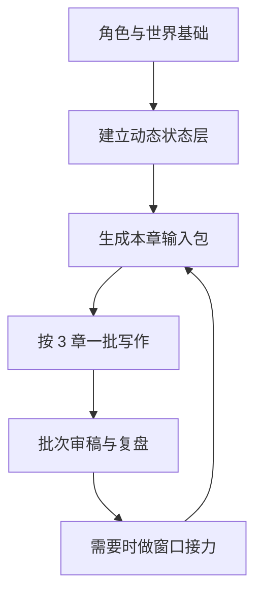

# 推荐工作流

这套仓库最适合的用法，不是“一次把所有东西都喂给 AI”，而是按阶段逐步激活。

## 1. 建基础层

先做这些：

- 填 `templates/character-palette.template.md`
- 填 `templates/multi-faces.template.md`
- 填 `templates/behavior-boundaries.template.md`
- 填 `templates/character-appearance.template.md`
- 填 `templates/story-outline.template.md`
- 填 `templates/worldbuilding.template.md`

目标不是一次写得很全，而是先把核心人物的行为逻辑、全书骨架和世界观底盘立住。

## 2. 建动态状态层

在正式开写前，至少准备：

- 角色状态表
- 情感债账本
- 未收线索表
- 时间线 / 世界状态表

可以直接从 `templates/longform-state.template.md` 起步，再按你的项目需要拆分。

## 3. 每章前只喂输入包

每次开写前，先填：

- `templates/chapter-input-pack.template.md`

原则是：

- 只喂当前真正相关的信息
- 带上目标风格样本
- 明确本章存在理由和章尾残留
- 三人以上且场面复杂时，额外补一张 `methods/multi-character.md` 里的多人场景小卡

## 4. 按 3 章为一个批次推进

推荐节奏：

1. 连写 3 章
2. 每章写完先跑 `python tools/ban-check.py <章节文件>`
3. 再人工过 `methods/review-checklist.md`
4. 更新 `templates/batch-notes.template.md` 对应的项目文件
5. 记录这批已经高频的手法，防止下一批偷懒复用

## 5. 需要换窗口时，再做接力

如果要换 AI 窗口，不要只贴角色和设定。

最少同时交出：

- 当前批次记录
- 当前窗口隐性共识快照
- 最近三章
- 反模板补丁
- 活人感补丁

公开仓库里对应的模板是：

- `templates/session-snapshot.template.md`
- `templates/handoff.template.md`

## 6. 每 3-5 章做一次小复盘

重点看四件事：

- 最近几章的节奏是不是太像
- 哪个角色开始只剩一种反应
- 哪条线索该提醒了还没提醒
- 哪笔情感债已经拖得太久

一句话总结：

**这套工作流不是为了让 AI 一次记住所有东西，而是为了让每一章都只带着最该被激活的那部分信息上场。**
